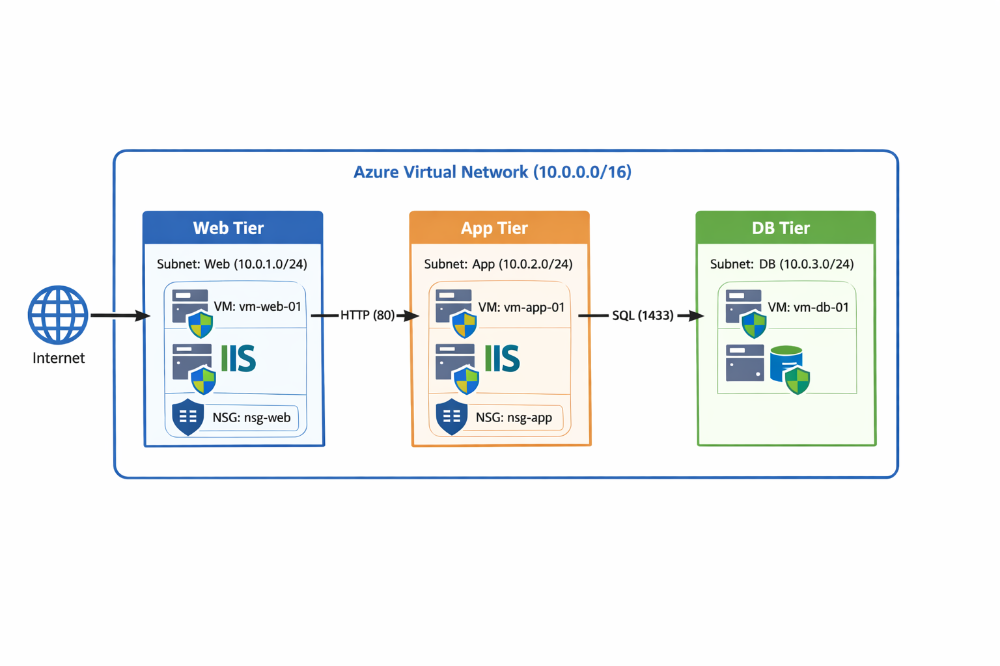

# Azure 3-Tier Architecture Lab (AZ-104)

## Overview
This project demonstrates a production-style 3-tier architecture built in Microsoft Azure using secure network segmentation and controlled communication between tiers.

The lab was implemented entirely using the Azure Portal and focuses on real-world infrastructure design, security, and troubleshooting.

---

## Architecture

This lab implements a secure 3-tier architecture inside an Azure Virtual Network.

- Web Tier (Public) — Handles incoming HTTP traffic from the internet
- App Tier (Private) — Processes internal application logic
- Database Tier (Private) — Stores data with restricted access

### Traffic Flow

Internet → Web Tier → App Tier → Database Tier

- Internet → Web (HTTP 80)
- Web → App (HTTP 80)
- App → DB (SQL 1433)

### Architecture Diagram

---

## Components

- Virtual Network: 10.0.0.0/16
- Subnets:
  - Web: 10.0.1.0/24
  - App: 10.0.2.0/24
  - DB:  10.0.3.0/24

- Virtual Machines:
  - vm-web-01 (Public)
  - vm-app-01 (Private)
  - vm-db-01 (Private)

- Network Security Groups:
  - nsg-web
  - nsg-app
  - nsg-db

- Web Server:
  - IIS installed on Web and App tiers

---

## Security Design

- Internet access allowed only to Web Tier (port 80)
- Web → App communication allowed (port 80)
- App → DB communication allowed (port 1433)
- No direct public access to App or DB tiers
- Subnet-level NSG implementation (best practice)

---

## Connectivity Flow

- Internet → Web VM (HTTP)
- Web VM → App VM (internal HTTP)
- App VM → DB VM (SQL port)

---

## Implementation Steps (High-Level)

1. Created Resource Group
2. Designed Virtual Network and subnets
3. Configured NSGs for each tier
4. Deployed Web VM with public access
5. Installed IIS and verified HTTP connectivity
6. Deployed App VM (private subnet)
7. Enabled internal RDP via Web VM (jump host)
8. Installed IIS on App VM and verified internal communication
9. Deployed DB VM (private subnet)
10. Configured App → DB secure communication

---

## Troubleshooting & Lessons Learned

- Resolved VM OS initialization issue by redeploying VM
- Identified difference between Azure NSG and Windows Firewall
- Fixed HTTP access issue by enabling Windows Firewall rule
- Learned how to debug connectivity using:
  - RDP
  - Serial Console
  - Test-NetConnection

---

## Screenshots

All implementation steps are documented in:

📁 `/screenshots`

Includes:
- Resource deployment
- NSG rules
- VM configuration
- Connectivity testing

---

## Skills Demonstrated

- Azure Virtual Networking (VNet, Subnets)
- Network Security Groups (NSG)
- Multi-tier architecture design
- Secure traffic flow implementation
- Windows Server & IIS setup
- Troubleshooting cloud infrastructure issues

---

## Future Improvements

- Add Azure Load Balancer (Web Tier)
- Implement Azure Bastion (secure access)
- Convert deployment to Terraform (IaC)
- Add monitoring with Azure Monitor / Log Analytics

---

## Repository Structure

azure-3tier-architecture-lab/
│
├── README.md
└── screenshots/
└── *.png

---

## Author

**Ali Laghari**  
Azure Administrator (AZ-104) | Networking & Cloud Infrastructure

---
